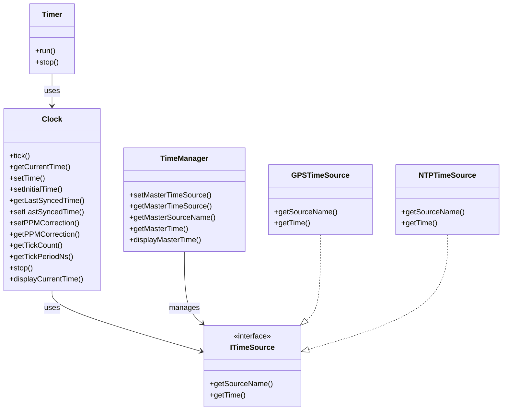

# TimeMaster

Generated by AI.

TimeMaster is a hobby project for experimenting with C++ time management, hardware timer simulation, and synchronization with external time sources (GPS, NTP).

## Features

- Simulates a hardware timer using C++ threads.
- Provides a `Clock` class for timekeeping and tick counting.
- Supports multiple time sources (GPS, NTP) via polymorphic interfaces.
- TimeManager for switching and displaying master time sources.
- PPM correction and time discipline logic.

## Project Structure

| File/Folder                        | Description                                      |
|------------------------------------|--------------------------------------------------|
| `src/main.cpp`                     | Main application entry point.                    |
| `src/clock/clock.cpp`              | Implementation of the `Clock` class.             |
| `src/timer/timer.cpp`              | Implementation of the `Timer` class.             |
| `src/time_sources/gps_time_source.cpp` | GPS time source implementation.             |
| `src/time_sources/ntp_time_source.cpp` | NTP time source implementation.             |
| `include/clock/clock.h`            | Declaration of the `Clock` class.                |
| `include/timer/timer.h`            | Declaration of the `Timer` class.                |
| `include/time_manager/time_manager.h` | TimeManager class and related headers.       |
| `include/time_sources/i_time_source.h` | Time source interface.                      |
| `Makefile`                         | Build instructions for the project.              |

## Usage

Run the compiled executable. The program will:
- Start a simulated hardware timer.
- Display the system clock precision.
- Show current time from different sources.
- Demonstrate switching between GPS and NTP time sources.

## Class Schematic

